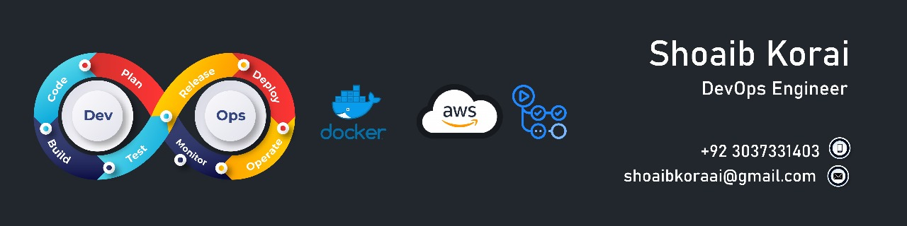

	

	

 

 

&nbsp;

<h1 align="center">
  ABOUT ME
</h1>
  

	
I’m Muhammad Shoaib Korai, a passionate and highly skilled DevOps Engineer with a strong foundation in cloud infrastructure, automation, and system engineering. With hands-on experience in designing and deploying highly available, fault-tolerant, and scalable architectures on AWS, I’ve led and contributed to projects that drive efficiency, resilience, and innovation across cloud environments.

Currently working remotely at SignDevOps (Florida), I specialize in leveraging a wide range of AWS services such as EC2, VPC, Lambda, RDS, CloudFormation, and CodePipeline to build robust DevOps solutions. My proficiency extends to automating infrastructure and application deployments using Ansible, Shell scripting, and serverless tools. I’m deeply involved in CI/CD pipeline implementation, cloud migration, and performance optimization of complex distributed systems.

With a background in system administration, virtualization (VMware, VBOX), and monitoring (SolarWinds, CloudWatch), I bring a comprehensive approach to DevOps—ensuring operational stability, efficient monitoring, and fast issue resolution. I thrive in fast-paced, collaborative environments where continuous learning and improvement are key to success.

Whether it’s building infrastructure from the ground up, automating repetitive processes, or improving system reliability, I take pride in solving problems and delivering scalable, production-ready solutions.

 **Outside of professional engagements, I actively contribute to the tech community by making open-source contributions, guiding students & professionals.**
<h2 align="center">
  My Skillset
</h2>

**| Python, Java, Dart , bash |**
**AWS Cloud & ORACLE Cloud |**
**Docker, Kubernetes |**
**GitHub Actions  Jenkins (CI/CD) |**
**GNU Linux, Namespaces & Containerization |**
**Microservices Architecture and Best Practices |**

## I often come up with implementing my own ideas and using my own DevOps solutions to increase productivity.

  
  <!--  -->
  
  <!--  -->

